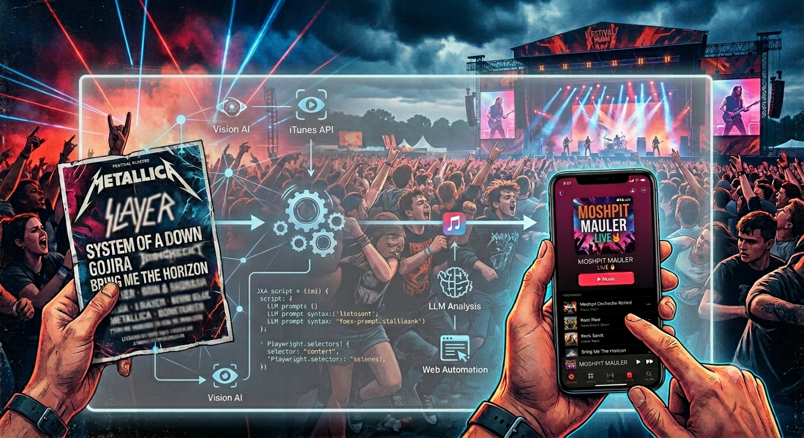

# Moshpit Mauler



Ever stared at a massive festival poster with fifty tiny artist names and wished you could instantly hear them all? *
*Moshpit Mauler** is here to help: it takes a massive festival flyer and absolutely shreds it into a perfectly organized
**Apple Music** playlist, saving you from the manual search-and-add grind.

Behind the scenes, this tiny little program does some _heavy_ lifting:

- **Spins up the Playlist**: Automatically checks your library and creates the target playlist if it doesn't already
  exist (powered by local macOS JXA).
- **Extracts the Lineup**: Extracts artist names from whatever source you feed it—whether that's parsing a poster flyer
  using a local vision-LLM, scraping a festival schedule URL, or just reading a simple text file.
- **Resolves the Top Tracks**: Gathers the top tracks (defaulting to 20) for each artist, leveraging iTunes APIs and
  local LLM fallback chains, while intelligently filtering out duplicates.
- **Automates the Injection**: Uses Playwright and Chromium to automate the Apple Music web player, searching for the
  resolved tracks and adding them directly to the target playlist (requiring just a one-time manual login).

Now you can share that playlist with your best friends so you can all rock out together!

Built by a metalhead who enjoys listening to music all the time. 🤘

## Prerequisites

- **Operating System**: macOS (Darwin) is required to run JXA osascript automation.
- **Apple Music**: An active Apple Music subscription is required to search the global shared catalog.
- **Local LLM Runner**: A running instance of an OpenAI-compatible local LLM server (such as Ollama, oMLX, LM Studio, or
  vLLM).
- **Terminal Permissions**: When running the script, macOS will prompt you to grant Terminal or your IDE permission to
  control "System Events" and "Music". You must grant these automation permissions.
- **Playwright Browsers**: Requires Chromium browser binaries for headless web automation.

## Installation

We standardize on `uv` for package and environment management.

1. Install `uv` if you haven't already:
   ```bash
   brew install uv
   ```
2. Clone the repository and install dependencies:
   ```bash
   make install
   uv run playwright install chromium
   ```
   This will automatically create a virtual environment (`.venv`), sync all packages, and install browser binaries.

## Configuration

Configure the application using environment variables (with fallback defaults). You can define these in your shell
profile or prefix your commands:

| Variable                            | Description                                         | Default                  |
|-------------------------------------|-----------------------------------------------------|--------------------------|
| `MOSHPIT_LLM_BASE_URL`              | Base URL of your local OpenAI-compatible LLM server | `http://localhost:11434` |
| `MOSHPIT_LLM_MODEL`                 | Model name to use for extraction                    | `llava`                  |
| `MOSHPIT_LLM_TIMEOUT`               | Timeout limit (in seconds) for LLM queries          | `120.0`                  |
| `MOSHPIT_DEFAULT_TRACKS_PER_ARTIST` | Default number of tracks to add per performer       | `20`                     |
| `MOSHPIT_JXA_TIMEOUT`               | Timeout (in seconds) for Apple Music Apple Events   | `30.0`                   |

> [!NOTE]
> The default base URL (`http://localhost:11434`) and model (`llava`) are set up for Ollama. The application sends
> requests to the standard `/v1/chat/completions` endpoint relative to `MOSHPIT_LLM_BASE_URL`.
> Legacy environment variables (`MOSHPIT_OLLAMA_BASE_URL`, `MOSHPIT_OLLAMA_MODEL`, `MOSHPIT_OLLAMA_TIMEOUT`) are
> supported as fallback aliases for backwards compatibility.

### Compatible Local LLM Runners & Models

You can use any local LLM runner that provides an OpenAI-compatible `/v1/chat/completions` endpoint:

#### 1. Ollama

Ollama exposes its OpenAI-compatible endpoint at port `11434`.

* **VLM (Vision-Language Models)** (for poster images & lineups):
    * **`llava`** (Default): Excellent, well-rounded vision model. Recommended for lineup poster analysis.
    * **`bakllava`**: A LLaVA-based model utilizing Mistral backing, yielding higher quality extraction on complex
      layouts.
    * **`moondream`**: A lightweight (1.6B parameter) vision model. Extremely fast and resource-efficient.
* **Text-Only Models** (for webpage HTML text):
    * **`llama3` / `llama3.1`**: Highly capable and instruction-tuned. Excellent at formatting JSON lists.
    * **`mistral`**: Great instruction following and reasoning behavior.
    * **`gemma2`**: Google's lightweight open model family, highly structured and precise.

#### 2. oMLX (MLX-compatible local runners)

oMLX provides Apple Silicon optimized local inference.

* Configure the environment:
  ```bash
  export MOSHPIT_LLM_BASE_URL="http://localhost:8000"  # or whichever port your oMLX server runs on
  export MOSHPIT_LLM_MODEL="mlx-community/Llama-3-8B-Instruct-4bit"
  ```

#### 3. LM Studio / vLLM

Both runners expose standard OpenAI compatibility.

* For LM Studio:
  ```bash
  export MOSHPIT_LLM_BASE_URL="http://localhost:1234"
  export MOSHPIT_LLM_MODEL="model-identifier-in-lm-studio"
  ```
* For vLLM:
  ```bash
  export MOSHPIT_LLM_BASE_URL="http://localhost:8000"
  export MOSHPIT_LLM_MODEL="your-deployed-vllm-model"
  ```

## Usage

Moshpit Mauler provides a CLI tool via `uv run moshpit` with the following commands:

- [`run`](#1-run-command): Ingest source assets and generate an Apple Music playlist.
- [`analyze`](#2-analyze-command): Inspect playlist statistics, unique artists, and track duplicate versions.
- [`prune`](#3-prune-command): Remove duplicates or tracks from a specific artist.
- [`sync`](#4-sync-command): Synchronize two playlists, mirroring tracks from source to destination.

---

### 1. Run Command

Extract artists from the input and generate an Apple Music playlist containing their top tracks.

#### Web Scraper Ingestion

Fetches an event schedule URL, strips nav/footers/styling, clean-formats body text, and extracts artists:

```bash
uv run moshpit run "https://aftershockfestival.com/lineup" --playlist "Aftershock 2026"
```

> [!NOTE]
> Check out
> this [Aftershock 2026 Apple Music Playlist](https://music.apple.com/in/playlist/aftershock-2026/pl.u-d2b0kEBtMkDXzv)
> for an example of a playlist compiled using this method.

#### Vision Lineup Ingestion

Reads a local poster/flyer image and runs VLM extraction:

```bash
uv run moshpit run "lineup_flyer.jpg" --playlist "Festival Poster Lineup"
```

#### Plain Text Ingestion

Reads a local plain text file containing a list of artists (one per line):

```bash
uv run moshpit run "artists.txt" --playlist "Favorite Artists"
```

#### Run Options

```bash
uv run moshpit run [OPTIONS] INPUT_PATH
```

- `INPUT_PATH`: Path to local image file, text file, or schedule HTTP/HTTPS URL.
- `-p, --playlist TEXT`: Name of the target Apple Music playlist. If omitted, the name is auto-generated from the
  filename or URL domain.
- `-s, --storefront TEXT`: The Apple Music storefront region to use (e.g. `us`, `in`, `gb`) for catalog searches (
  default: `us`).
- `-t, --tracks-per-artist INTEGER`: Overrides the number of top tracks to append per artist (default: `20`).
- `--dry-run`: Extracts artists and performs track resolution checks, but does **not** modify or create any playlists.
- `--print-artists`: Extracts and prints the list of artists to standard output, then exits immediately. This option
  skips JXA/macOS validation checks, allowing you to test extraction on non-macOS platforms.
- `-f, --force-refresh`: Force refresh and bypass cache for playlist sync and artist search.
- `-v, --verbose`: Enables detailed `DEBUG` console log tracing.

---

### 2. Analyze Command

Analyze an Apple Music playlist, showing stats, unique artists, or duplicate track versions.

```bash
uv run moshpit analyze [OPTIONS]
```

- `-p, --playlist TEXT` (Required): Name of the target Apple Music playlist.
- `--list-artists`: List all unique artist names in the playlist.
- `--list-duplicates`: List all duplicate track versions in the playlist.
- `-v, --verbose`: Enable debug logging output.

#### Examples

- Show summary:
  ```bash
  uv run moshpit analyze -p "Aftershock 2026"
  ```
- List duplicate tracks:
  ```bash
  uv run moshpit analyze -p "Aftershock 2026" --list-duplicates
  ```

---

### 3. Prune Command

Prune duplicate track versions, or remove all tracks by a specific artist from a playlist.

```bash
uv run moshpit prune [OPTIONS]
```

- `-p, --playlist TEXT` (Required): Name of the target Apple Music playlist.
- `--artist TEXT`: Remove all songs by this artist instead of pruning duplicates.
- `--dry-run`: Simulate execution without modifying the playlist.
- `-v, --verbose`: Enable debug logging output.

#### Examples

- Remove duplicate track versions:
  ```bash
  uv run moshpit prune -p "Aftershock 2026"
  ```
- Remove all tracks by a specific artist:
  ```bash
  uv run moshpit prune -p "Aftershock 2026" --artist "Metallica"
  ```

---

### 4. Sync Command

Synchronize one playlist (source) to another (destination), making the destination mirror the source exactly. This is
extremely useful if you share a playlist with friends (via Apple Music share link) and want to update its contents using
a fresh/scratch playlist without breaking the share link or changing the playlist ID.

```bash
uv run moshpit sync [OPTIONS]
```

- `-s, --source TEXT` (Required): Name of the source playlist to sync from.
- `-d, --destination TEXT` (Required): Name of the destination playlist to sync to.
- `--dry-run`: Simulate the sync process without modifying the destination playlist.
- `-v, --verbose`: Enable debug logging output.

#### Examples

- Dry run simulation of sync:
  ```bash
  uv run moshpit sync -s "Festival Temp" -d "Public Festival Playlist" --dry-run
  ```
- Perform the actual sync (overwriting destination's tracks with source's tracks):
  ```bash
  uv run moshpit sync -s "Festival Temp" -d "Public Festival Playlist"
  ```

## Developer CLI

Run Makefile helper targets for quality checks:

- **Install Dependencies**: `make install`
- **Auto-Format Code**: `make format`
- **Lint & Type-Check**: `make lint`
- **Run Pytest Coverage**: `make test`
- **Clean Cache Files**: `make clean`

## Telemetry & Unresolved Matches

If any artists extracted by the LLM are skipped (e.g. they aren't found in Apple Music's global catalog or trigger
osascript execution timeouts), they are recorded in `failure_manifest.json` under your workspace root directory. This
telemetry report allows you to adjust spelling, billing stage designations, or search bounds offline. If a subsequent
run completes with zero failures, any previous failure manifest is cleaned up automatically.
